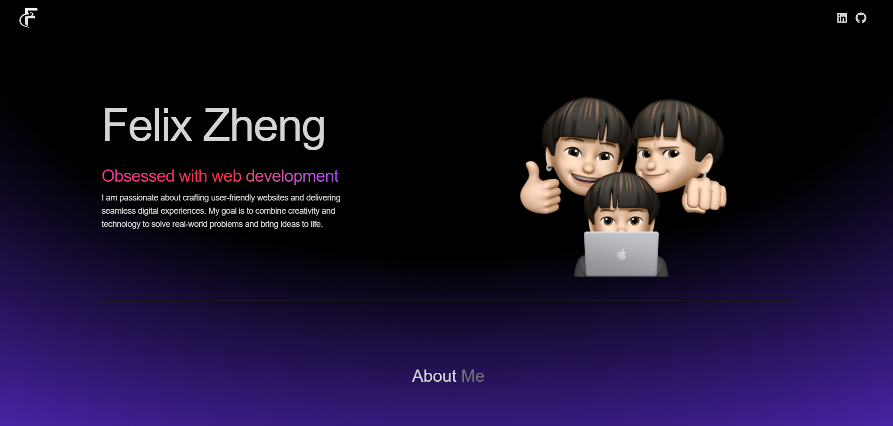

# My Portfolio

這是一個展示我個人資訊、技能和作品的個人網站

## 🌍 部署
此專案已部署於 Render.com，透過以下連結直接訪問：
👉 [Felix's Portfolio](https://felix-portfolio-omega.vercel.app/)

## ✨ 功能特色
- **個人介紹** 簡要介紹我的背景與專業領域。
- **技能展示** 列出我擅長的技術與工具。
- **作品展示** 精選過去的項目，附帶詳細描述與預覽連結。
- **響應式設計** 適應不同設備，提供流暢的瀏覽體驗。


## 🛠 使用技術
- **前端設計**：React + Chakra UI
- **樣式設計**：Tailwind Css
- **部署平台**：Vercel.com

## 安裝與使用 ⭐

Clone專案：

   ```bash
   git clone https://github.com/zlix1214/FelixPortfolio.git
   npm install
   npm run dev
